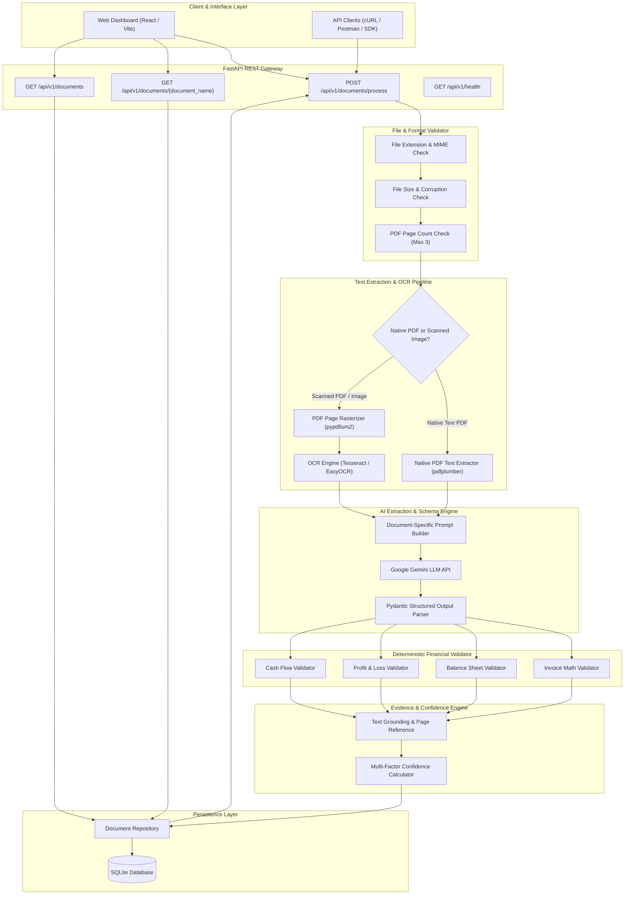

# Architecture Design & Implementation Plan
## Intelligent Document Extraction, Validation & API Platform

---

## 1. System Overview

The **Intelligent Document Extraction, Validation & API Platform** is an enterprise-grade document intelligence system designed to ingest, process, validate, extract, and reconcile financial documents (Invoices, Balance Sheets, Profit & Loss Accounts, and Cash Flow Statements).

### Key System Capabilities
- **Multi-Format Ingestion**: Ingests raster image formats (`.jpg`, `.jpeg`, `.png`) and document formats (`.pdf`) up to 3 pages per request.
- **Dual Text Processing Pipeline**: Automatically routes native vector PDFs to direct text extractors (`pdfplumber` / `pypdf`) and scanned documents/images to a high-accuracy OCR engine (`pytesseract` / `pypdfium2`).
- **AI-Powered Semantic Extraction**: Leverages Large Language Models (LLM / Google Gemini) with strict Pydantic schemas to extract key-value pairs, nested line items, multi-year comparative financial tables, and explicit evidence grounding snippets without hallucination.
- **Deterministic Financial Validation**: Executes pure Python mathematical verification for Invoices (line item math, tax splits, grand totals), Balance Sheets (accounting equation equality), Profit & Loss statements (income/expenditure reconciliations), and Cash Flows (cash reconciliations).
- **Explainable Confidence Scoring**: Computes a multi-factor confidence index combining OCR quality, evidence grounding in raw text, schema completeness, and financial validation status.
- **RESTful API & Interactive Dashboard**: Provides FastAPI endpoints for async processing and retrieval, persisted via SQLite, paired with a modern React/Vite dashboard.

---

## 2. Architecture Diagram (Mermaid)



---

## 3. Component Responsibilities

| Component | Primary Responsibility | Key Technologies / Libraries |
| :--- | :--- | :--- |
| **FastAPI Controller** | HTTP routing, request parsing, response formatting, status codes, OpenAPI documentation. | `fastapi`, `uvicorn`, `pydantic` |
| **File Validator** | Validates file format (`.pdf`, `.jpg`, `.jpeg`, `.png`), file header signatures, non-zero size, maximum page count (≤ 3 pages). | `pypdf`, `python-magic`, `PIL` |
| **PDF Text Extractor** | Fast vector text and table extraction for native PDFs. | `pdfplumber`, `pypdf` |
| **Page Rasterizer** | Converts PDF pages into high-DPI (300 DPI) images for OCR processing. | `pypdfium2` |
| **OCR Engine** | Extracts text and bounding boxes from scanned PDF pages and raster invoice images. | `pytesseract` / `EasyOCR` |
| **AI Extractor** | Formulates document-specific system prompts, sends text context to LLM, and enforces structured JSON generation. | `google-genai` / `langchain-google-genai` |
| **Pydantic Schema Layer** | Enforces strict typing, field default behaviors, nullability, and JSON validation. | `pydantic` v2 |
| **Financial Validator** | Executes pure Python mathematical verification logic without relying on LLM arithmetic. | Standard Python `decimal`, `math` |
| **Evidence & Grounding Engine** | Verifies extracted text snippets against raw OCR/PDF text and maps page numbers. | Python `re`, fuzzy text matching |
| **Confidence Scorer** | Computes a weighted 0.0–1.0 score based on OCR quality, grounding, schema completeness, and math validation. | Pure Python algorithm |
| **Document Repository** | Handles database CRUD operations, filename deduplication, and GET latest record logic. | `SQLAlchemy` (async) / `sqlite3` |
| **React Dashboard** | Renders file upload UI, processing status indicator, extracted JSON tree view, and validation status pills (`PASS`/`FAIL`/`NOT_APPLICABLE`). | React 18, Vite, Lucide Icons, Tailwind / Vanilla CSS |

---

## 4. End-to-End Data Flow

```
[User Upload] 
   │
   ▼
1. File Ingestion & Validation
   ├── Check Extension: .pdf, .jpg, .jpeg, .png
   ├── Check Size: > 0 bytes & < 10 MB
   ├── Check Page Count: <= 3 pages
   └── IF Invalid ──► Return 400 Bad Request + FileValidation Error JSON
   │
   ▼
2. Text Extraction & OCR
   ├── Detect Native vs Scanned PDF (text length threshold > 50 chars/page)
   ├── Native PDF: Extract text via pdfplumber
   ├── Scanned PDF/Image: Render at 300 DPI -> Run Tesseract/EasyOCR
   └── Output: Raw text per page + page metadata
   │
   ▼
3. AI Extraction Strategy
   ├── Select System Prompt based on document_type (Invoice, Balance Sheet, P&L, Cash Flow)
   ├── Send Raw Text + Pydantic Schema to Gemini LLM
   ├── Parse & Deserialize into Pydantic Data Model
   └── Output: Structured Extracted Model
   │
   ▼
4. Financial Validation Layer
   ├── Run deterministic Python mathematical rules on extracted numbers
   ├── Invoice: Qty * Rate == Line Total; Subtotal + Tax + Rounding == Grand Total
   ├── Balance Sheet: Assets == Liabilities + Equity
   ├── P&L: Total Income == Interest + Other; Total Exp == Interest + Ops + Provisions
   ├── Cash Flow: Net Cash Increase == Operating + Investing + Financing + FX; Ending Cash == Opening + Increase
   └── Output: Status (PASS / FAILED / NOT_APPLICABLE) + Rules Audit List
   │
   ▼
5. Evidence & Confidence Engine
   ├── Attach source_text snippet and page_number to every field
   ├── Calculate Multi-Factor Confidence Score (0.00 to 1.00)
   └── Output: Complete Validated Document JSON Payload
   │
   ▼
6. Storage & Response
   ├── Store document record in SQLite database
   ├── Return 200 OK + Full Processed JSON Payload to API / Dashboard
   └── Render structured UI views in Dashboard
```

---

## 5. Document-Type Processing Design

### A. Invoices
- **Information Extracted**:
  - *Header*: Invoice Number, Issue Date, Due Date, Terms (`Net 30`), Currency, Language.
  - *Parties*: Vendor Name, Address, Tax ID (GSTIN/TRN/VAT), Phone, Email; Buyer Name, Address, Tax ID; Consignee/Ship-To details.
  - *Shipping/Order*: PO Number, Customer Account No, Order Date, Carrier, Waybill No.
  - *Line Items Table*: Item Code / HSN, Description, Quantity, Unit Price, Tax Rate, Discount, Line Amount.
  - *Totals*: Subtotal, CGST, SGST, IGST, VAT, HST, Rounding Adjustment, Grand Total, Amount in Words, Cash Paid, Change.
- **Table Representation**: Array of structured Pydantic line-item objects.
- **Missing Values**: Represented explicitly as `null`.
- **Validation Checks**:
  1. `Quantity * Unit Price == Line Amount` (within $0.05 tolerance).
  2. `Sum(Line Amounts) == Subtotal`.
  3. `Subtotal + Total Tax + Rounding Adjustment == Grand Total`.
  4. `CGST == SGST` for dual Indian GST invoices.
- **Status Rules**:
  - `PASS`: All present line items and total math check out cleanly.
  - `FAILED`: Any mathematical equality fails beyond tolerance.
  - `NOT_APPLICABLE`: Critical calculation fields (e.g. Subtotal or Grand Total) are missing from the document.

### B. Balance Sheet
- **Information Extracted**:
  - *Header*: Entity Name (`HDFC Bank Limited`), As At Date (`March 31, 2026`), Currency Scale (`₹ in crore` vs `₹ in '000`).
  - *Liabilities*: Capital, Stock Options, Reserves & Surplus, Minority Interest, Deposits, Borrowings, Other Liabilities & Provisions, Policyholders' Funds, Total Capital & Liabilities.
  - *Assets*: Cash & RBI Balances, Bank Balances, Investments, Advances, Fixed Assets, Other Assets, Goodwill, Total Assets.
  - *Notes & Off-Balance*: Contingent Liabilities, Bills for Collection.
  - *Signatures*: Auditors (Firm Names, ICAI Reg Nos, Partner Names, Membership Nos), Directors & Officers.
- **Comparative Periods**: Multi-column dictionary mapping year strings (e.g. `"2026"` and `"2025"`).
- **Validation Checks**:
  1. `Total Capital & Liabilities (Year T) == Total Assets (Year T)`
  2. `Total Capital & Liabilities (Year T-1) == Total Assets (Year T-1)`
  3. `Total Capital & Liabilities == Capital + Reserves + Deposits + Borrowings + Other Liabilities + Policyholders' Funds`
- **Status Rules**:
  - `PASS`: Balance sheet equation holds (`Assets == Liabilities + Equity`) for all comparative periods.
  - `FAILED`: Assets do not equal Liabilities + Equity for any period.
  - `NOT_APPLICABLE`: Balance Sheet totals are unextracted or missing.

### C. Profit & Loss Statement
- **Information Extracted**:
  - *Header*: Statement Title, Period Ended Date (`March 31, 2026`), Currency Scale, Share Face Value (`₹ 1`).
  - *Income*: Interest Earned (Sched 13), Other Income (Sched 14), Total Income.
  - *Expenditure*: Interest Expended (Sched 15), Operating Expenses (Sched 16), Provisions & Contingencies (Sched 18), Total Expenditure.
  - *Profit*: Net Profit Before Minority Interest, Minority Interest, Share in Associates, Consolidated Net Profit Attributable to Group, Brought Forward Profit, Total Profit.
  - *Appropriations*: Transfers to Statutory/General/Capital/Special Reserves, Dividends Paid/Proposed, Balance Carried to Balance Sheet, Total Appropriations.
  - *EPS*: Basic EPS, Diluted EPS.
- **Parentheses Negatives**: Extracted as negative float values (e.g., `(382.96)` -> `-382.96`).
- **Validation Checks**:
  1. `Total Income == Interest Earned + Other Income`
  2. `Total Expenditure == Interest Expended + Operating Expenses + Provisions & Contingencies`
  3. `Net Profit Attributable to Group == Net Profit Before Minority Interest - Minority Interest + Share in Associates`
  4. `Total Appropriations == Total Profit`
- **Status Rules**: `PASS` if income, expense, and profit reconciliations pass; `FAILED` if math mismatches; `NOT_APPLICABLE` if key totals are missing.

### D. Cash Flow Statement
- **Information Extracted**:
  - *Header*: Statement Title, Period Ended Date, Scale Unit.
  - *Operating*: Profit Before Tax, Depreciation, Adjustments, Working Capital Changes, Direct Taxes Paid -> Net Operating Cash Flow.
  - *Investing*: Purchase/Sale of Fixed Assets, Investments -> Net Investing Cash Flow.
  - *Financing*: Issue/Redemption of Debt/Shares, Dividends Paid -> Net Financing Cash Flow.
  - *Reconciliation*: Exchange Fluctuation Effect, Amalgamation Cash, Net Increase/Decrease in Cash, Opening Cash (April 1st), Ending Cash (March 31st).
- **Validation Checks**:
  1. `Net Increase in Cash == Operating Cash Flow + Investing Cash Flow + Financing Cash Flow + Exchange Fluctuation + Amalgamation Cash`
  2. `Ending Cash == Opening Cash + Net Increase in Cash`
  3. `Ending Cash (Cash Flow) == Cash & RBI + Bank Balances (Balance Sheet)`
- **Status Rules**: `PASS` if cash reconciliation checks out; `FAILED` if cash flow math fails; `NOT_APPLICABLE` if section totals are missing.

---

## 6. Structured JSON Schema Design

The API response schema strictly follows this consolidated model:

```json
{
  "document_name": "Consolidated_Balance_Sheet_2026.pdf",
  "document_type": "BALANCE_SHEET",
  "processing_status": "COMPLETED",
  "file_validation": {
    "is_valid": true,
    "file_type": "application/pdf",
    "file_size_bytes": 131719,
    "page_count": 1,
    "is_native_pdf": false,
    "errors": []
  },
  "extracted_data": {
    "header": {
      "entity_name": {
        "value": "HDFC Bank Limited",
        "evidence": "HDFC BANK LIMITED",
        "source_text": "CONSOLIDATED BALANCE SHEET As at March 31, 2026",
        "page_number": 1,
        "confidence": 0.98
      },
      "as_at_date": {
        "value": "2026-03-31",
        "evidence": "As at March 31, 2026",
        "source_text": "As at March 31, 2026",
        "page_number": 1,
        "confidence": 0.99
      },
      "scale_unit": {
        "value": "crore",
        "evidence": "(₹ in crore)",
        "source_text": "(₹ in crore)",
        "page_number": 1,
        "confidence": 0.95
      }
    },
    "comparative_years": ["2026", "2025"],
    "sections": [
      {
        "section_name": "CAPITAL AND LIABILITIES",
        "line_items": [
          {
            "line_item_name": "Capital",
            "schedule_number": "1",
            "values": {
              "2026": 1539.34,
              "2025": 765.22
            },
            "page_number": 1,
            "confidence": 0.96
          },
          {
            "line_item_name": "Reserves and surplus",
            "schedule_number": "2",
            "values": {
              "2026": 579975.02,
              "2025": 517218.98
            },
            "page_number": 1,
            "confidence": 0.97
          }
        ],
        "total": {
          "2026": 4908040.84,
          "2025": 4392417.42
        }
      },
      {
        "section_name": "ASSETS",
        "line_items": [
          {
            "line_item_name": "Cash and balances with Reserve Bank of India",
            "schedule_number": "6",
            "values": {
              "2026": 200707.11,
              "2025": 144390.25
            },
            "page_number": 1,
            "confidence": 0.97
          }
        ],
        "total": {
          "2026": 4908040.84,
          "2025": 4392417.42
        }
      }
    ]
  },
  "validation": {
    "status": "PASS",
    "summary": "All 3 balance sheet validation rules passed cleanly across all comparative periods.",
    "rules_executed": [
      {
        "rule_id": "BS_EQUALITY_2026",
        "description": "Total Capital and Liabilities == Total Assets for 2026",
        "status": "PASS",
        "calculated_value": 4908040.84,
        "expected_value": 4908040.84,
        "difference": 0.0
      },
      {
        "rule_id": "BS_EQUALITY_2025",
        "description": "Total Capital and Liabilities == Total Assets for 2025",
        "status": "PASS",
        "calculated_value": 4392417.42,
        "expected_value": 4392417.42,
        "difference": 0.0
      }
    ]
  },
  "processing_metadata": {
    "processing_time_ms": 1420,
    "ocr_engine_used": "Tesseract-OCR",
    "llm_model_used": "gemini-1.5-flash",
    "timestamp": "2026-09-10T16:05:00Z"
  }
}
```

---

## 7. OCR Strategy

- **Native PDF vs OCR Detection**:
  - For PDF files, inspect text length extracted via `pypdf`/`pdfplumber`.
  - **Threshold**: If total text extracted across all pages is `< 50 characters`, classify the document as **Scanned PDF** and trigger the OCR Pipeline.
- **Rasterization Pipeline**:
  - Render scanned PDF pages at **300 DPI** using `pypdfium2` to generate crisp PNG images.
- **OCR Engine**:
  - Primary: **Tesseract OCR** (via `pytesseract`) configured with `--oem 3 --psm 6` (Assume a single uniform block of text).
  - Fallback: **EasyOCR** or **PyMuPDF** text rendering if Tesseract confidence is low.
- **Empty / Failure Handling**:
  - If OCR returns empty text or fails completely, throw `OCRError` (422 Unprocessable Entity) with messaging: *"Failed to extract legible text from document scan."*
- **Page Preservation**:
  - Each page's text is tagged with `page_number` (1-indexed), preserving exact page boundaries for evidence tracking.

---

## 8. AI Extraction Strategy

- **LLM Engine**: Google Gemini API (`gemini-1.5-flash` or `gemini-2.0-flash`) using Pydantic structured output mode (`response_mime_type="application/json"` with schema).
- **Prompt Engineering Rules**:
  1. **Strict Zero-Hallucination**: Extract ONLY values explicitly present in raw text. Return `null` for missing fields. Never infer or guess values.
  2. **Verbatim Evidence**: For every extracted scalar field, extract the exact substring as `evidence` and surrounding sentence/line as `source_text`.
  3. **Parentheses as Negative Numbers**: Convert bracketed numbers such as `(16,909)` or `(1,546.40)` to negative float numbers `-16909.0` and `-1546.40`.
  4. **Comparative Columns**: Map current year and prior year columns accurately into key-value dictionaries.
  5. **Scale Units**: Extract the document scale unit (`thousands`, `crores`, `millions`) verbatim from the document header.

---

## 9. Confidence & Evidence Strategy

- **Decision**: **YES**, implement a transparent, explainable confidence score.
- **Confidence Formula**:
  $$\text{Confidence Score} = (0.30 \times C_{\text{OCR}}) + (0.30 \times C_{\text{Grounding}}) + (0.20 \times C_{\text{Schema}}) + (0.20 \times C_{\text{Validation}})$$

Where:
- $C_{\text{OCR}}$: Average character recognition confidence reported by OCR engine (1.0 for native PDFs).
- $C_{\text{Grounding}}$: Fraction of extracted scalar fields whose `evidence` string exists in raw source text (0.0 to 1.0).
- $C_{\text{Schema}}$: Percentage of required non-null schema fields successfully populated without truncation.
- $C_{\text{Validation}}$: 1.0 if financial validation status is `PASS`, 0.5 if `NOT_APPLICABLE`, 0.0 if `FAILED`.

---

## 10. Financial Validation Design

A pure, deterministic Python validation service (`FinancialValidator`) executes math checks independently of the LLM.

- **Numerical Tolerance**: Set to **$\pm 1.0$** unit (or $0.05$ for ratios/tax percentages) to accommodate rounding adjustments (`Round Off` / `Rounding Adj`).

### Deterministic Rule Matrix

```python
# Invoice Validation Example
def validate_invoice(inv_data: InvoiceData) -> ValidationResult:
    rules = []
    # Rule 1: Line Item Math
    for item in inv_data.line_items:
        calc_total = item.quantity * item.unit_price
        diff = abs(calc_total - item.line_total)
        rules.append(RuleAudit("LINE_ITEM_MATH", diff <= 1.0, calc_total, item.line_total, diff))
    
    # Rule 2: Subtotal Reconciliation
    sum_items = sum(item.line_total for item in inv_data.line_items)
    diff_sub = abs(sum_items - inv_data.financials.subtotal)
    rules.append(RuleAudit("SUBTOTAL_RECONCILIATION", diff_sub <= 1.0, sum_items, inv_data.financials.subtotal, diff_sub))
    
    # Rule 3: Grand Total Math
    calc_grand = inv_data.financials.subtotal + inv_data.financials.tax_amount + inv_data.financials.rounding_adjustment
    diff_grand = abs(calc_grand - inv_data.financials.grand_total)
    rules.append(RuleAudit("GRAND_TOTAL_MATH", diff_grand <= 1.0, calc_grand, inv_data.financials.grand_total, diff_grand))
    
    # Determine Final Status
    if any(r.status == "FAILED" for r in rules):
        return ValidationResult(status="FAILED", rules=rules)
    return ValidationResult(status="PASS", rules=rules)
```

- **`NOT_APPLICABLE` Rule**: If any primary field required for a calculation (e.g. `subtotal` or `grand_total`) is `null`, the rule status returns `NOT_APPLICABLE` rather than raising a failure.

---

## 11. Database Design

### SQLite Schema (`documents.db`)

```sql
CREATE TABLE IF NOT EXISTS document_records (
    id INTEGER PRIMARY KEY AUTOINCREMENT,
    document_name VARCHAR(255) NOT NULL,
    document_type VARCHAR(50) NOT NULL,
    processing_status VARCHAR(50) NOT NULL, -- 'PENDING', 'COMPLETED', 'FAILED'
    file_validation_json TEXT NOT NULL,
    extracted_data_json TEXT,
    validation_results_json TEXT,
    processing_metadata_json TEXT,
    created_at TIMESTAMP DEFAULT CURRENT_TIMESTAMP,
    updated_at TIMESTAMP DEFAULT CURRENT_TIMESTAMP
);

CREATE INDEX idx_doc_name ON document_records(document_name);
CREATE INDEX idx_doc_type ON document_records(document_type);
```

### Filename Deduplication / GET Latest Logic
When `GET /api/v1/documents/{document_name}` is invoked:
```sql
SELECT * FROM document_records 
WHERE document_name = :document_name 
ORDER BY created_at DESC 
LIMIT 1;
```
This guarantees that processing the same filename multiple times records history while immediately returning the most recent extraction result.

---

## 12. API Design

### Endpoints Specification

1. **`POST /api/v1/documents/process`**
   - **Method**: `POST`
   - **Content-Type**: `multipart/form-data`
   - **Parameters**: `file` (UploadFile), `document_type` (Optional Query/Form Enum: `INVOICE`, `BALANCE_SHEET`, `PROFIT_AND_LOSS`, `CASH_FLOW`, `AUTO_DETECT`).
   - **Response Code**: `200 OK` (Processed), `400 Bad Request` (Invalid File/Page count), `422 Unprocessable Entity` (OCR/LLM failure).

2. **`GET /api/v1/documents/{document_name}`**
   - **Method**: `GET`
   - **Response Code**: `200 OK` (Latest JSON record), `404 Not Found` (Document name not found in DB).

3. **`GET /api/v1/documents`**
   - **Method**: `GET`
   - **Query Parameters**: `limit` (default 50), `offset` (default 0), `document_type` (optional filter).
   - **Response Code**: `200 OK` (List of processed document summaries).

4. **`GET /api/v1/health`**
   - **Method**: `GET`
   - **Response**: `{"status": "healthy", "version": "1.0.0", "timestamp": "2026-09-10T16:05:00Z"}`

---

## 13. Error Handling

- **Error Hierarchy**:
  - `DocumentProcessingException` (Base Exception)
  - `FileValidationException` (HTTP 400)
  - `PageLimitExceededException` (HTTP 400 - >3 pages)
  - `OCRExtractionException` (HTTP 422)
  - `AIExtractionException` (HTTP 422)
  - `DatabaseException` (HTTP 500)
- **Security & Privacy**: Stack traces, environment variables, and Gemini API keys are caught internally and logged securely; client responses receive clean, sanitized JSON error payloads.

---

## 14. Logging Strategy

- **Structured JSON Logging** using standard Python `logging` module.
- **Log Events Tracked**:
  - `REQUEST_RECEIVED`: `[POST /process] filename=batch1-1109.jpg, size=212KB`
  - `FILE_VALIDATED`: `is_valid=True, page_count=1`
  - `TEXT_EXTRACTED`: `method=OCR_Tesseract, char_count=1450, elapsed_ms=320`
  - `AI_EXTRACTED`: `model=gemini-1.5-flash, status=SUCCESS, elapsed_ms=850`
  - `FINANCIAL_VALIDATED`: `status=PASS, rules_passed=3, rules_failed=0`
  - `DB_STORED`: `record_id=42`
- **Secret Redaction**: Filter prevents API keys or passwords from appearing in log streams.

---

## 15. Testing Strategy (20 Test Scenarios)

1. **Valid PDF Ingestion**: Process single-page PDF document.
2. **Valid JPG Ingestion**: Process JPG invoice image (`batch1-1109.jpg`).
3. **Valid PNG Ingestion**: Process PNG document image.
4. **Unsupported File Format**: Upload `.docx` or `.txt` file -> Expect 400 Bad Request.
5. **Empty File**: Upload 0-byte file -> Expect 400 Bad Request.
6. **Corrupted PDF**: Upload corrupted PDF byte stream -> Expect 400 Bad Request.
7. **Page Count Limit (> 3 pages)**: Upload 4-page PDF -> Expect 400 Bad Request (`Page count exceeds maximum limit of 3`).
8. **Native PDF Extraction**: Extract native text from `Consolidated Cash Flow Statement 2022.pdf`.
9. **Scanned PDF OCR**: Extract scanned PDF text via pypdfium2 + Tesseract (`Consolidated Balance Sheet 2017.pdf`).
10. **Invoice Extraction**: Extract complete header, line items, and totals from invoice dataset.
11. **Balance Sheet Extraction**: Extract multi-year assets and liabilities from Balance Sheet dataset.
12. **Profit & Loss Extraction**: Extract income, expense, net profit, and appropriations from P&L dataset.
13. **Cash Flow Extraction**: Extract operating, investing, financing, and cash reconciliation from Cash Flow dataset.
14. **Validation PASS**: Verify clean `PASS` on accurate financial document.
15. **Validation FAIL**: Inject mismatched subtotal -> Verify status returns `FAILED`.
16. **Validation NOT_APPLICABLE**: Omit subtotal -> Verify status returns `NOT_APPLICABLE`.
17. **End-to-End API Flow**: Execute `POST /api/v1/documents/process` and verify full response payload.
18. **GET-by-Name Endpoint**: Execute `GET /api/v1/documents/{document_name}` and verify latest record returned.
19. **Document List Endpoint**: Execute `GET /api/v1/documents` and verify paginated summary list.
20. **Health Check Endpoint**: Execute `GET /api/v1/health` -> Expect status `healthy`.

---

## 16. Deployment Strategy

- **Backend API**: Deployed on Render / Railway / Fly.io (FastAPI + Python runtime + Tesseract binary).
- **Frontend Dashboard**: Deployed on Vercel / Netlify (React Static / Vite SPA).
- **Swagger Documentation**: Available publicly at `/docs` on the backend URL.
- **Environment Variables**: Managed via deployment dashboard secrets (`GEMINI_API_KEY`, `ENVIRONMENT=production`).

---

## 17. Implementation Stages (Stage 2A to 2M)

### Stage 2A: Configuration & Environment Setup
- **Files**: `.env.example`, `app/config.py`, `requirements.txt`
- **Goal**: Setup environment variable management (Gemini API key, database URL, log levels).

### Stage 2B: FastAPI Application & Health Endpoint
- **Files**: `app/main.py`, `app/api/v1/health.py`
- **Goal**: Initialize FastAPI instance, CORS middleware, and `/api/v1/health` endpoint.

### Stage 2C: File Validation Engine
- **Files**: `app/services/file_validator.py`, `app/schemas/file_validation.py`
- **Goal**: Validate file formats, non-zero sizes, and maximum page count (≤ 3 pages).

### Stage 2D: Text Extraction & OCR Engine
- **Files**: `app/services/pdf_extractor.py`, `app/services/ocr_engine.py`
- **Goal**: Implement `pdfplumber` native text extraction and `pypdfium2` + `pytesseract` raster OCR pipeline.

### Stage 2E: Pydantic Structured Schemas
- **Files**: `app/schemas/invoice.py`, `app/schemas/balance_sheet.py`, `app/schemas/profit_loss.py`, `app/schemas/cash_flow.py`, `app/schemas/response.py`
- **Goal**: Define Pydantic models for all 4 document types, evidence wrappers, and response payload.

### Stage 2F: AI Extraction Engine
- **Files**: `app/services/ai_extractor.py`, `app/prompts/`
- **Goal**: Integrate Google Gemini API with system prompts and structured Pydantic response parsing.

### Stage 2G: Deterministic Financial Validation Engine
- **Files**: `app/services/financial_validator.py`
- **Goal**: Implement Python math verification rules for Invoices, Balance Sheets, P&L, and Cash Flows.

### Stage 2H: Database & Repository Layer
- **Files**: `app/db/database.py`, `app/db/models.py`, `app/repositories/document_repo.py`
- **Goal**: Implement SQLite schema, SQLAlchemy session management, and GET-latest document query.

### Stage 2I: End-to-End Processing Orchestrator
- **Files**: `app/services/document_orchestrator.py`, `app/api/v1/documents.py`
- **Goal**: Connect validation -> OCR -> AI -> Math Verification -> DB storage -> REST response.

### Stage 2J: Frontend React Dashboard
- **Files**: `frontend/src/App.jsx`, `frontend/src/components/`
- **Goal**: Build modern React dashboard with File Upload, Status Pills, JSON Tree Viewer, and History List.

### Stage 2K: Comprehensive Test Suite
- **Files**: `tests/test_file_validator.py`, `tests/test_ocr.py`, `tests/test_financial_validator.py`, `tests/test_api.py`
- **Goal**: Implement and execute 20 automated Pytest scenarios.

### Stage 2L: Deployment Configuration
- **Files**: `Dockerfile`, `render.yaml`, `vercel.json`
- **Goal**: Configure containerization and free-tier deployment configurations.

### Stage 2M: Documentation & Presentation
- **Files**: `README.md`, `docs/architecture_and_implementation_plan.md`, `docs/presentation.pptx`
- **Goal**: Finalize system documentation, API guide, sample outputs, and slide deck.

---

## 18. Risks and Mitigations

| Risk | Potential Impact | Mitigation Strategy |
| :--- | :--- | :--- |
| **Blurry / Low-Res Scans** | OCR misreads numbers or characters. | Image preprocessing (grayscale conversion, thresholding) + confidence scoring penalty. |
| **Scale Shifts Across Years** | Magnitude error (`₹ in '000` vs `₹ in crore`). | Header scale unit explicitly extracted as a first-class schema field and displayed in dashboard. |
| **Parentheses Negatives** | OCR misinterprets `(100)` as positive `100`. | Explicit LLM prompt instruction + regex fallback converting `(X)` to `-X`. |
| **LLM Rate Limits** | API request timeouts during batch tests. | Retry logic with exponential backoff + fallback model (`gemini-1.5-flash`). |

---

## 19. 3-Day Execution Plan Roadmap

```
┌────────────────────────────────────────────────────────────────────────┐
│ DAY 1: CORE ENGINE & EXTRACTION                                        │
├────────────────────────────────────────────────────────────────────────┤
│ • Setup FastAPI project structure & environment configs (Stage 2A-2B)  │
│ • Implement File Validation & PDF/OCR Pipeline (Stage 2C-2D)           │
│ • Build Pydantic Schemas for 4 Document Types (Stage 2E)               │
│ • Integrate Gemini LLM Structured Extraction Engine (Stage 2F)         │
└────────────────────────────────────────────────────────────────────────┘
                                   │
                                   ▼
┌────────────────────────────────────────────────────────────────────────┐
│ DAY 2: FINANCIAL VALIDATION, STORAGE & API                             │
├────────────────────────────────────────────────────────────────────────┤
│ • Build Pure Python Financial Validation Service (Stage 2G)            │
│ • Implement SQLite Database & Repository Layer (Stage 2H)              │
│ • Build FastAPI Processing & Retrieval Endpoints (Stage 2I)            │
│ • Write Pytest Suite for 20 Scenarios (Stage 2K)                       │
└────────────────────────────────────────────────────────────────────────┘
                                   │
                                   ▼
┌────────────────────────────────────────────────────────────────────────┐
│ DAY 3: DASHBOARD, DEPLOYMENT & PRESENTATION                            │
├────────────────────────────────────────────────────────────────────────┤
│ • Build React/Vite Frontend Dashboard (Stage 2J)                       │
│ • Connect Dashboard to FastAPI REST Endpoints                          │
│ • Configure Deployment Files & Validate Open API Docs (Stage 2L)       │
│ • Finalize README, Sample Outputs & PPT Presentation (Stage 2M)        │
└────────────────────────────────────────────────────────────────────────┘
```
